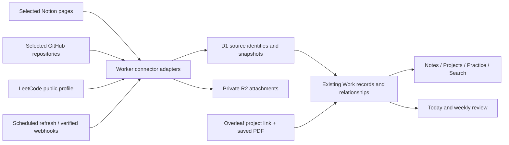

# Historical connector plan (retired)

> Retired by the 4 October 2026 simplification. The material below preserves the earlier connector design; its deployment statements and commands describe that historical implementation, not the current release or setup instructions. See the [current README](../readme.md) and [verification](verification.md).

The current product has four pages: Home, Learn, Applications, and Documents. There is no Connectors destination. Scheduled source mirroring, suggestion generation, and webhook ingestion are inactive; old webhook delivery paths return a retired response. Do not enable the historical polling or webhook flows as part of the simplified product.

Learn now uses explicit authenticated Work endpoints under `/api/learning` to read authored content, accumulated solve observations, and shared task progress from the fixed personal-site source `https://manavdodia.com`. Configure a LeetCode username in Settings. Overleaf documents are saved URLs that open externally, without an upload or connector setup requirement.

Existing credentials, records, revisions, and files remain retained for recovery. Settings exposes removal of existing connections with imported records kept. Legacy compatibility and credential-retention code is not a background integration workflow. Applying migrations still includes `0003_connectors.sql` before the additive `0004_simplification.sql`; normal learning requests need no new Notion/GitHub connector registration.

## Archived design reference

Planning baseline: 4 October 2026. The first connector implementation is deployed to production and staging, with mocked provider/runtime verification and published preview browser checks. Real provider registrations and authenticated selected-source smoke tests remain environment-specific setup gates. See [connector setup](connectors-setup.md) and [release verification](verification.md). The design baseline below also records later refinements, including personal-site history import and a verified Overleaf embed.

Work should bring the tools you already use into one career workspace. Connect a source once, choose what belongs in Work, and let the workspace keep it current. Work adds the goals, priorities, reflections, and next actions that make those sources useful together.

The first connector release covers **Notion for notes, GitHub for projects, LeetCode for practice progress, and Overleaf for résumé access**. Each is optional. Setup should ask for a connection and a small selection of material, then show useful results immediately.

This updates the README's earlier treatment of integrations as a later extension. The existing career workflows remain the foundation, with connected information becoming the preferred way to populate the areas that have an external source.

## 1. Starting from the existing app

The current app already provides the pieces this direction needs:

| Existing piece                                                                           | How to extend it                                                                         |
| ---------------------------------------------------------------------------------------- | ---------------------------------------------------------------------------------------- |
| Notes, projects, practice, assets, record links, and global search                       | Present connected material in the existing routes and link it to career work             |
| Today, focus sessions, and weekly review                                                 | Use connected activity as context for practical next actions and factual summaries       |
| GitHub sign-in through Better Auth                                                       | Keep account identity separate from permission to access repositories                    |
| Owner-scoped D1 records, revisions, private R2 attachments, submitted-document snapshots | Add source identity and synchronization while retaining these guarantees                 |
| Markdown/Notion export import with provenance                                            | Reconcile existing imports with live sources instead of importing everything again       |
| Settings fields for GitHub, LeetCode, and Overleaf links                                 | Offer these as setup suggestions; a saved URL does not count as an authorized connection |
| Synthetic public preview                                                                 | Demonstrate connector states and connected workflows using synthetic fixtures            |

The personal website's `/learn` implementation is a useful starting point: `src/lib/leetcode.ts` fetches public profile statistics, calendar data, and recent accepted submissions; its `solveStore.ts` accumulates observed problems over time. Port the relevant logic into this repository so Work can operate independently of the personal website.

## 2. The user experience

### Pick the tools you use

Add a **Connectors** page at `/connectors`, reachable beside Settings in the sidebar and through contextual links in Notes, Projects, Practice, and Career assets. Keep the current task-oriented navigation.

For a new workspace, show a short, skippable setup:

1. Choose sources: Notion, GitHub, LeetCode, Overleaf.
2. Connect the selected sources using their appropriate flow.
3. Select notes/repositories, confirm the LeetCode handle, or save the Overleaf project link.
4. Preview what will appear in Work and start the initial import.
5. Land on Today with links to the connected material and one useful suggested action.

For an existing workspace, offer “Connect your tools” without restarting onboarding. Connect one source at a time and keep setup progress if another source fails. Nothing requires connecting all four.

Each connector card shows its icon, purpose, account/workspace, selected scope, status, and main action. For example:

> **Notion** · Notes and knowledge  
> Hunting Season · 13 selected pages  
> Connected · Updated 8 minutes ago  
> **Manage pages** · Refresh

Use distinct, truthful states: **Not connected**, **Setting up**, **Updating**, **Connected**, **Needs attention**, and **Paused**. Overleaf's initial state is **Linked**, since a project link alone does not synchronize its contents. Show the last successful update separately from the latest failed attempt.

Connection details expose selection, refresh, pause, reconnect, and disconnect controls. A compact update history reports results such as “3 notes updated” or “2 accepted submissions found.” Errors give a specific recovery action and preserve the last successful data.

### Use connected information where it belongs

| Screen                            | Proposed connected behaviour                                                                                                                               |
| --------------------------------- | ---------------------------------------------------------------------------------------------------------------------------------------------------------- |
| Notes                             | Source filters: All, Work, Notion; search selected Notion pages; read a cached copy; open the original for editing                                         |
| Projects                          | Selected GitHub repositories become project cards with current source details; add milestones, contribution notes, and case studies in Work                |
| Practice                          | Show connected solve totals and observed problem activity; match problems to the existing catalogue; add a reflection or recall review with a short action |
| Career assets                     | Open the Overleaf source beside a saved résumé PDF, its version label, and the applications using it                                                       |
| Global search and related records | Find connected notes/projects alongside native records; retain source badges and ordinary record deep links                                                |
| Today                             | Surface linked preparation material and actionable suggestions informed by current activity                                                                |
| Weekly review                     | Summarize observed practice and project changes together with completed Work actions and application progress                                              |

Leave goals, opportunity stages, personal contributions, interview feedback, and decisions under the user's control. Providers supply facts; Work records the meaning and plan. Additional forms should ask only for information the source cannot provide.

Example: a GitHub repository updates → Work offers “Capture the engineering decision behind this change” → the user records a short reflection → that evidence becomes available for a behavioural story or résumé bullet. A repository change does not automatically prove a personal achievement.

Optional section visibility can be a later preference. Disconnecting a source must not make existing work disappear from navigation.

## 3. Preserve the visual language

Use the implemented design in `src/styles.css` as the baseline, including its softer accent palette. The README's original token proposals are historical design context.

| Existing token or component                                    | Connector use                                                         |
| -------------------------------------------------------------- | --------------------------------------------------------------------- |
| Ink `#202128`, canvas `#faf9f6`, white cards                   | Existing dark sidebar, calm page background, readable connector cards |
| Aqua `#8bdfd6`                                                 | Notes/Notion accent                                                   |
| Blue `#315bff`                                                 | GitHub/projects accent                                                |
| Orange `#ffad65`                                               | LeetCode/practice accent                                              |
| Pink `#ff78ba`                                                 | Overleaf/assets accent                                                |
| Lime `#d6f653`                                                 | Successful connection and completed setup accents                     |
| Space Grotesk headings, DM Sans body                           | Existing type hierarchy and concise, friendly copy                    |
| `PageHeader`, `Card`, `Badge`, `Button`, `Modal`, `EmptyState` | Build the catalogue and setup flows from current primitives           |

Use small accent strips, icon tiles, and badges within mostly neutral cards. Keep the existing rounded corners, outlined controls, offset button shadows, and press feedback. Provider marks identify sources; Work's colours organize the interface.

Desktop uses a two-column catalogue and a focused connection detail view. Mobile stacks cards and turns selections into simple lists. Status always includes text and an icon; verify dark mode, keyboard focus, touch targets, and reduced motion. Connection success can use the existing brief stamp/check feedback.

## 4. Connector specifications

### Notion: keep the knowledge library current

**Setup:** Prefer a Notion public connection using OAuth and its page picker. For an initial owner-only development spike, an internal connection token shared with selected pages is sufficient; keep this configuration on the server. Public OAuth avoids asking future users to create their own integrations. Implement token refresh and reconnect according to the current authorization contract. [Notion authorization](https://developers.notion.com/guides/get-started/authorization).

**Select:** Discover accessible pages/data sources, then let the user choose a few pages or a collection. Provider authorization defines the maximum scope; Work's selection narrows what it imports. Make inclusion of descendants explicit. Start with plain pages and simple note databases; defer arbitrary database-to-career-field mappings.

**Read:** Prefer the official page Markdown endpoint. Normalize Notion's enhanced Markdown into the subset the current renderer supports; retain source links for unsupported elements and fetch blocks where necessary. Handle truncation and permission gaps explicitly. Media links expire, so copy selected supported attachments into private R2 and rewrite references. [Notion Markdown guide](https://developers.notion.com/guides/data-apis/working-with-markdown-content), [retrieve page Markdown](https://developers.notion.com/reference/retrieve-page-markdown).

**Maintain:** Initially use background incremental reconciliation and Refresh. Add verified webhooks to shorten update latency, while retaining periodic reconciliation for missed events. Webhook events are change notifications; fetch current content through the API. [Notion webhooks](https://developers.notion.com/reference/webhooks).

**Edit:** Synced page content opens in Notion for editing. Work can add tags, links, annotations, and actions without changing the source. “Make a Work copy” creates an independent editable note with provenance. Bidirectional editing can be evaluated after reliable read-only synchronization.

**Useful result:** A selected interview-preparation note is searchable in Work, linked to an interview, and updates after editing it in Notion, without re-uploading an export.

### GitHub: projects with less maintenance

**Setup:** Use a dedicated GitHub App with access to selected repositories. The existing sign-in requests `read:user` and `user:email`; it does not authorize private repository access. Verify installation ownership before associating it with the signed-in Work user. GitHub Apps support repository-specific grants and built-in webhooks. [About GitHub Apps](https://docs.github.com/en/apps/creating-github-apps/about-creating-github-apps/about-creating-github-apps).

**Scope:** Start with repository metadata and read-only Contents for README/default-branch information, plus read-only Pull requests and Issues only if those features are included. Choose the smallest permissions needed by the implemented endpoints and events. [GitHub App permissions](https://docs.github.com/en/apps/creating-github-apps/registering-a-github-app/choosing-permissions-for-a-github-app).

**Select:** Show accessible repositories and let the user include only relevant projects. A lightweight public-profile mode can later avoid installation for public repositories; it should use the same adapter and explain its reduced access.

**Populate:** Repository name, description, URL, language metadata, topics, README, archive state, and recent relevant changes. Let an existing manually entered project attach to its repository. Keep Work's project title override, status, milestones, case study, demo link override, and personal contribution notes independent of source refreshes.

**Maintain:** Stable GitHub repository IDs survive renames. Use conditional requests, pagination, selected webhook events, and periodic reconciliation. Show activity on selected projects; require a user reflection before promoting a change into career evidence.

**Useful result:** Select three repositories once; their source details stay current while Work organizes the next milestone and the story worth explaining about each.

### LeetCode: automatic practice facts

**Setup:** Enter a public username or profile URL and preview the returned profile. Do not require a password or session cookie. Describe this as tracking a public profile; a handle is not proof of ownership.

**Reuse:** Port the personal site's server-side query and normalization approach, then validate the query from Work's actual Cloudflare runtime. The existing implementation uses LeetCode's website GraphQL endpoint; this research has not established an official supported public API contract. Treat the adapter as best effort and isolate query/schema failures.

**Populate:** Difficulty totals, provider calendar counts, and observed recent accepted submissions. Match problem slugs to the existing catalogue. Store accepted submission observations separately from user-authored practice attempts, so synchronization cannot invent confidence, time spent, language, explanation quality, or review success.

**History:** The current personal-site query requests a recent feed of 20 items. Recheck the upstream limit during the spike. Persist observations with submission IDs when available, otherwise a stable handle/slug/timestamp key. Retain repeat solves; derive unique solved problems separately. The existing `solveStore.ts` deliberately collapses repeat solves, so its storage format is insufficient for a practice-event history.

**Honest coverage:** Aggregate solve totals can exceed the identifiable problem history. Label “Observed since connection” and any imported history separately. Calendar submission counts do not identify which problems were solved or prove successful recall. Missed feed items cannot be reconstructed simply by polling later.

**Maintain:** Cache results, limit refreshes, preserve the last successful view, and allow native attempt/reflection logging during an outage. Store event timestamps in UTC and group them using the user's timezone, including Melbourne daylight-saving transitions. Avoid copying the personal site's fixed AEST day handling.

**Useful result:** Solve on LeetCode, then open Work to find the observed solve and optionally add a reflection or schedule a review without re-entering the problem details.

### Overleaf: source access and trustworthy résumé versions

**Initial connector:** Save a private project URL, an optional label, and the corresponding résumé asset. Show **Open in Overleaf**, the latest saved PDF preview, version date, and **Upload new PDF**. Work already supports PDF attachments and immutable submitted-asset snapshots.

**Iframe feasibility:** Test a real project with its actual authentication and response headers before promising an embedded editor. Verify Overleaf's framing policy, browser cookie behaviour, mobile usability, and Work's CSP. The current `frame-src 'self' blob:` excludes external frames. If embedding is supported, add a narrowly scoped allowlist and an optional “Open editor here” view. Always provide the external link; an iframe failure must leave the résumé workflow usable. Do not make the project public to enable embedding.

**Later automation:** Overleaf documents premium Git/GitHub synchronization. If that is available to the account, the GitHub connector can track synchronized LaTeX source. Source synchronization alone does not produce a compiled PDF; automated PDF retrieval/compilation needs its own verified integration. A general hosted editor/compilation API was not established by this research. [Overleaf Git and GitHub integration](https://docs.overleaf.com/integrations-and-add-ons/git-integration-and-github-synchronization).

**Useful result:** Open the source from Work and use the exact saved PDF for an application. Later source or PDF updates cannot change the document already recorded as submitted.

## 5. Ownership and synchronization rules

Use one-way source synchronization with a separate layer for user-authored context in the first release.

| Information                                                                     | Authority                                                        |
| ------------------------------------------------------------------------------- | ---------------------------------------------------------------- |
| Notion title/content, GitHub repository facts, LeetCode statistics/observations | Provider; refresh updates the source snapshot                    |
| Work annotations, relationships, goals, milestones, reflections, and actions    | Work; connector refresh cannot overwrite these                   |
| Copied notes and detached project records                                       | Work; preserve provenance and stop updating them from the source |
| Résumé/application submission snapshots                                         | Frozen saved version; never replaced by a connector refresh      |

Every synchronized object needs a stable provider identity, source URL, successful fetch time, source update time when available, content hash, and coverage/status. Mark provider content clearly in the UI.

Handle lifecycle explicitly:

- **Unchanged source:** no new record revision, duplicated activity, or repeated suggestion.
- **Changed source:** update only provider-owned fields; preserve Work context and record relationships.
- **Missing or inaccessible source:** mark unavailable and preserve the last copy with a warning. A failed request is not evidence of deletion. Permission revocation should immediately suppress the affected private source content from search/normal views until access is restored or retention is explicitly resolved.
- **Removed selection:** stop future refreshes; offer to retain a clearly detached copy or remove the cached source content. Keep related Work notes/actions.
- **Pause:** stop scheduled refreshes and show the last update time.
- **Disconnect:** remove stored credentials and stop jobs; revoke provider access where supported. Offer an explicit choice to keep detached copies or remove synchronized content. Default to preserving user-authored work.
- **Reconnect:** match stable identities and continue updating the same records.

Suggested actions use stable event/rule keys so polling and retries cannot flood Today. Users can accept, dismiss, or pin suggestions. Native deadlines and priorities remain the main ranking inputs; raw commit or solve counts do not become a readiness score.

## 6. Technical shape

Retain React/TypeScript, Hono, Better Auth, D1, and private R2. Add a small shared adapter interface for authorization, discovery, selection, fetch/normalize, refresh, and disconnect. Each provider declares its capabilities, such as `sync`, `link`, and verified `embed`, so an Overleaf link does not need a fake synchronization job.

Proposed additions:

| Layer                                             | Addition                                                                                  |
| ------------------------------------------------- | ----------------------------------------------------------------------------------------- |
| `shared/connectors.ts`                            | Provider definitions, capabilities, public connection states, and normalized source types |
| `worker/connectors/`                              | Registry, provider adapters, credential handling, sync orchestration, reconciliation      |
| `src/features/connectors/`                        | Catalogue, selection/setup, connection details, update history                            |
| `migrations/`                                     | Additive owner-scoped connection/source/job/activity tables                               |
| Existing domain pages and `src/components/ui.tsx` | Source badges, context actions, connected filters, reusable selection controls            |
| `src/lib/demo.ts`                                 | Synthetic source objects and connection states                                            |

Minimum durable state:

- **Connections:** owner, provider, provider account/workspace identity, selected configuration, status, last success/error, and credential reference.
- **External objects:** stable source key, connection association, normalized provider fields, source URL/timestamps/hash, visibility/availability, and mapped Work record. Enforce uniqueness within the owner's provider/account scope, including reconnects.
- **Sync jobs/runs:** cursor/checkpoint, bounded work, lease/attempts, next eligible time, and redacted results.
- **External activity:** accepted submissions and selected project events with unique source keys; derived summaries consume this table without manufacturing practice records.

Keep existing `WorkRecord` IDs stable as the objects that career relationships target. Store external field snapshots separately and expose mapped records through existing record APIs. Server-side write rules must reject edits to provider-owned fields while permitting Work annotations. Do not route provider updates through the browser's offline-edit outbox.

Start with D1-backed bounded jobs and a Worker `scheduled` handler; Cron Triggers support scheduled background work. Persist cursors and leases before returning so large imports resume and concurrent refreshes remain safe. Add Queues only if measured volume or delivery requirements justify it. [Cloudflare Cron Triggers](https://developers.cloudflare.com/workers/configuration/cron-triggers/).

Use one pipeline for initial setup, Refresh, scheduled updates, and verified webhook events. Apply mapped record changes and source checkpoints consistently through supported D1 batches; recover orphaned attachment uploads. Content hashes avoid unnecessary record revisions. Paginate source discovery and connected lists; avoid loading every submission or provider payload into the current all-records workspace context.

Suggested starting cadence, subject to runtime/provider tests: a 15-minute scheduler checks due jobs, GitHub hourly, Notion every 30 minutes, LeetCode every four hours, and a daily reconciliation of selected sources. Provider limits and retry backoff override these defaults. Webhooks can reduce latency for supported sources. Refresh is rate-limited and reports when the next attempt is available. Respect provider retry instructions, including Notion's `Retry-After` responses. [Notion request limits](https://developers.notion.com/reference/request-limits).

Keep credentials server-side, encrypted at rest with an environment-specific Worker secret and a rotation path. Exclude secrets from record JSON, client responses, logs, and content backups. Connector callbacks use single-use state bound to the existing Work session and configured origin. Webhooks verify signatures and resolve ownership from registered installations/workspaces, never a client-supplied owner ID. Use separate provider registrations/secrets and bindings for staging and production.

Parse provider content as untrusted input. Normalize enhanced Markdown instead of enabling arbitrary raw HTML; validate URLs and bounded attachment downloads, including redirect targets. Limit server fetching to supported provider/resource hosts. Overleaf links open in the browser until an explicitly verified integration exists.

## 7. Existing data, export, and recovery

Introduce this as an additive migration. Existing notes, projects, attempts, and résumé assets remain valid native records.

- **Notion imports:** the current importer uses a path-derived source hash, not a canonical Notion page ID. Use retained `originalPath` metadata to propose page-ID matches where available. Preview matches and content differences; confirm ambiguous or locally edited notes before attaching them to a live source. Never match solely by title or silently overwrite imported edits.
- **Manual projects:** canonicalize repository URLs, verify repository IDs, and propose linking existing project records. Keep their record IDs, milestones, relationships, and reflections.
- **Practice history:** retain native attempts. Link matching external observations without counting a manually recorded attempt and the same imported solve twice in summaries. Label count definitions explicitly.
- **Résumé archive:** retain imported PDFs and submitted copies; link Overleaf to the asset rather than replacing it.
- **Personal-site history:** offer a one-time selected export/import of existing observed solve history if available. Preserve its coverage and coarse date precision; it cannot establish every historical submission timestamp.
- **Backups:** extend versioned content export/restore to include source provenance, retained content, attachments, and activity. Restore connector configurations as disconnected; require reauthorization instead of exporting tokens. Preserve source identities so the first reconnect does not duplicate records.

## 8. Delivery sequence and acceptance

| Stage                         | Deliverable                                                                                                                                      | Exit condition                                                                                                                             |
| ----------------------------- | ------------------------------------------------------------------------------------------------------------------------------------------------ | ------------------------------------------------------------------------------------------------------------------------------------------ |
| 0. Feasibility                | Validate LeetCode from Work's runtime; test Notion Markdown/media fidelity; inspect real Overleaf framing; confirm provider registrations/scopes | Unknowns have recorded results and workable fallbacks before UI promises                                                                   |
| 1. Common foundation          | Additive schema, adapter contract, Connectors catalogue/setup, owner-scoped sync jobs, source badges, synthetic demo; Overleaf link/PDF flow     | A synthetic connection completes setup, refresh, pause, and disconnect on desktop/mobile without harming existing records                  |
| 2. First live slice: LeetCode | Port validated query/normalization, persistent observations, catalogue matching, connected Practice summary                                      | A public profile supplies useful progress; repeat refreshes are idempotent; failure preserves cached data and native reflections           |
| 3. GitHub projects            | Selected-repository installation, discovery, repository-to-project mapping, source updates, Work context                                         | A repository refresh updates source facts while preserving milestones, case studies, and existing links                                    |
| 4. Notion notes               | OAuth/internal spike path, selected notes, Markdown normalization, attachment copying, reconciliation, existing-import mapping                   | Edit in Notion, refresh, search in Work, and open the note from interview prep; edited archive notes and attachments remain recoverable    |
| 5. Cohesive daily use         | Today/review suggestions, verified webhooks where useful, export/restore, permission-loss recovery, setup polish                                 | Complete a preparation/application journey using connected notes, practice, projects, and a frozen résumé PDF with little duplicated entry |

Build the live connectors as complete vertical slices: selection → real fetch → mapped screen → background refresh → recovery. The common foundation should stay small enough to evolve from those slices.

Required implementation checks:

- Cross-user and cross-environment isolation for source records, credentials, callbacks, webhooks, search, and attachments.
- Pagination, partial imports, expired tokens, revoked permissions, duplicate/out-of-order events, rate limits, and retries.
- No overwriting of local annotations/drafts; no resurrection of removed selections; no changes to submitted PDFs.
- LeetCode repeat solves, partial history, duplicate manual observations, and Melbourne DST boundaries.
- Notion unsupported formatting, expiring file URLs, internal links, and existing edited-export reconciliation.
- Connector setup, useful empty states, disconnected/outage states, narrow screens, keyboard use, dark mode, and reduced motion.
- Meaningful provider-mocked integration tests plus a staging smoke test with explicitly selected real sources. Use the existing `check`, test, browser-test, and build commands for the implementation release.

The release is useful when connecting a few sources eliminates routine re-entry of note content, repository facts, and observed practice activity, while Work makes the next career action easier to choose. Measure setup effort, duplicate records, freshness, and how often connected material is used in preparation or applications.

## 9. Scope after the first connector release

Consider calendar integration for interview events, and a selected Notion database mapping for an existing application tracker, after the four initial connectors work reliably. These can reduce additional manual upkeep without committing to broad email access or unsupported job-site integrations.

Provider-neutral capability definitions leave room for alternative note/project/practice tools later. Start with these four concrete implementations; expand from actual use instead of building a plugin marketplace or a universal field-mapping system upfront.
