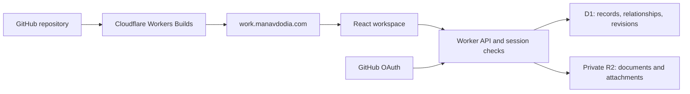

# Work

An all-in-one software-engineering career workspace: learn, practise, capture useful work, prepare interviews, manage applications, and choose the next chapter. Punchy arcade-inspired styling, without XP or levels.

Home: [work.manavdodia.com](https://work.manavdodia.com) · Repository: [manav1411/work](https://github.com/manav1411/work)

## Implementation status

Implemented and deployed to separate Cloudflare production and staging Workers, D1 databases and private R2 buckets. The production custom domain is attached and serves HTTPS with security headers. All launch areas below have working interfaces and server-backed persistence; the public preview is a separate, synthetic tab-only workspace.

Production GitHub OAuth credentials are configured, and the sign-in button reaches GitHub's real login. The owner has connected the repository in Cloudflare Builds. A successful real provider callback/private save and an observed Git-triggered deployment are the remaining verification gates; configuration and a CLI deployment alone do not prove those journeys. See [launch setup](docs/launch-setup.md).

The actual Notion export was verified locally: 13 notes, two screenshots, original source metadata and rewritten page links; the personal-site résumé PDF was also imported. The private migration archive is ignored by Git. No original personal notes or résumé PDF are included in repository fixtures or the public preview.

Implemented workflows include Today/actions/focus; Markdown notes/autosave/revisions/attachments; a 12-week DSA path, foundational engineering lessons and the 150-problem catalogue; manual practice attempts and recall reviews; company research and applications with immutable submitted-asset snapshots; résumé/letter/profile assets; interviews/STAR stories/mocks/calendar export; contacts/outreach drafts; evidence/projects/rotations/decision worksheets; weekly reviews; global search/capture; preferences; import/undo, trash and versioned backup/restore. Offline record edits queue on the current device and expose explicit recovery controls. There is no service-worker/offline-start guarantee, automatic email reminder, scheduled backup, job scraping, automatic application submission, Overleaf compilation or live LeetCode sync.

## Run locally

Use Node 22.18 or newer supported Node 22/24. Install dependencies, copy the local-only fixture configuration, and apply the migrations:

```sh
npm ci
cp .dev.vars.example .dev.vars
npm run db:local
npm run dev
```

Open `http://127.0.0.1:5180`. Local fixture access never authorises a production or staging session. `.dev.vars`, `.private`, `.wrangler`, exports and build output stay out of Git. For a real local OAuth test, disable the fixture and use a separate local OAuth application.

```sh
npm run check
npm test
npm run test:e2e
npm run build
```

Browser tests use installed Chrome locally; CI installs Playwright Chromium. Tests cover ownership/security with real emulated D1/R2, concurrent edits, idempotency, OAuth-state/callback restrictions, import/restore/file preservation, shared workflows, mobile routes and offline recovery. CI uses synthetic data only.

## Deployment and operations

The Vite plugin builds both the React client and Worker. `scripts/check-build.mjs` verifies the intended Worker, environment, domain and isolated database/file bindings before deployment.

```sh
npm run deploy:staging
npm run deploy
```

Production resources: Worker `work`, D1 `work-prod`, R2 `work-files-prod`. Staging resources: Worker `work-staging`, D1 `work-staging`, R2 `work-files-staging`; staging address is `https://work-staging.manavbdodia.workers.dev`. Production and staging require separate OAuth applications and secrets. The staging command selects the environment at build time; it cannot attach the production domain.

Read [launch setup](docs/launch-setup.md), [runtime and recovery](docs/operations.md), [security boundaries](docs/security.md), and [verification results](docs/verification.md). The complete original product/delivery plan is retained below; planned acceptance items are not a claim that pending account authorisations are complete.

## plan

Planning baseline: 2 October 2026. This section preserves the comprehensive product and delivery plan. Current implementation and outstanding release gates are described above.

### 1. Product direction and confirmed decisions

Work should make it easy to answer three questions: **What am I working towards? What should I do next? Where is everything I need to do it?** It brings learning, job searching, interview preparation, career evidence, and notes into one connected workspace.

The first complete release covers all these areas. Build them in stages so each part can be verified and used during development; every launch area below must be functional by the first complete release.

Confirmed requirements:

- A comprehensive career platform from the initial build: learning, practice, applications, interview preparation, documents, projects, networking, career planning, and notes.
- A private account with cloud sync, initially for Manav, with ownership and account boundaries designed for additional users later.
- A bold arcade visual style: punchy colours, expressive typography, playful controls, and delightful microinteractions. The arcade influence is visual. There are no XP systems, levels, game maps, or compulsory game mechanics.
- Strong functionality, especially fast capture, useful organisation, reliable saving, and clear next actions.
- Reuse relevant material from the Notion export and the personal website's learning area.
- A separate application at `work.manavdodia.com`, deployed from this GitHub repository through Cloudflare.

Implementation defaults to validate in the first delivery stage: GitHub sign-in, a responsive web app, Markdown-friendly notes, Python as the initial DSA practice language, and Cloudflare Workers/D1/R2. Current employer name, current engineering stack, exact weekly time budget, Overleaf project links, and US work-authorisation details remain onboarding fields rather than assumptions.

### 2. Manav's initial career strategy

The first workspace should be useful immediately, with the following goals and dates prefilled and editable:

- Desired next role: software engineer at a large technology company; Google is the leading aspiration.
- Longer-term destination: Silicon Valley / the San Francisco Bay Area.
- Current chapter: Melbourne, with experience from a backend engineering rotation and a current cybersecurity rotation.
- Application window: begin serious applications in late 2026.
- Decision window: February 2027, around the one-year mark and the end of the current rotation; compare external opportunities with available roll-off roles.

Keep three strategies visible as ordinary comparison cards, with linked companies, opportunities, research, contacts, uncertainties, and next actions:

| Path | What to track | First useful actions | Open questions |
| --- | --- | --- | --- |
| Australian big tech, then a possible US transfer | Australian SWE roles, engineering scope, relevant US teams, employer transfer information | Shortlist suitable roles; find employees who can explain team scope and mobility | Transfer requirements, timing, available teams, and sponsorship need employer-specific confirmation |
| Apply directly to US companies | US SWE roles, location, experience requirements, employer-stated work-authorisation requirements | Build a focused role list; identify recruiting contacts; record requirements from each vacancy | Work authorisation, sponsorship, relocation support, and hiring timelines are individual to the opportunity |
| Explore a Flutter-group move | Relevant parent-company teams and openings, contacts, engineering scope, verified mobility policy | Identify an appropriate internal contact and record what can actually be learned | This is a lower-confidence possibility, not a confirmed available route |

These paths can progress simultaneously. Each research entry needs a source, date checked, confidence, and next question. An internal transfer should remain a possibility until supported by current employer information. Location alone does not establish immigration eligibility; the app records user-provided circumstances and links to current official information when needed.

The rotation decision deserves its own worksheet: compare production ownership, technical depth, mentorship, demonstrable impact, relevance to target SWE roles, and personal interest. Include a potential frontend rotation. Earlier résumé notes already describe full-stack work, so the question is what additional depth and evidence another rotation would create. Backend and cybersecurity work should also feed concrete engineering stories and résumé bullets.

### 3. Career timeline to support

| Period | Career focus | What the platform should help produce |
| --- | --- | --- |
| October 2026 | Establish the target and capture current experience | Current résumé baseline, target-company shortlist, initial skill-gap review, work-evidence bank, sustainable weekly plan |
| November 2026 | Prepare application assets and practise consistently | Tailored résumé variants, reusable behavioural stories, problem-review routine, mock-interview feedback, contacts and role research |
| Late November–December 2026 | Start serious applications | A live application pipeline, relevant outreach, interview-specific preparation, deadlines and follow-ups |
| January 2027 | Respond to the actual pipeline | Interview preparation informed by feedback, targeted practice, refreshed role research, external and internal options |
| February 2027 | Make the next-chapter decision | A side-by-side comparison of offers and roll-off options, unresolved questions, decision criteria, and transition tasks |

Application deadlines can override this sequence. Completing a preparation checklist must never be a prerequisite for saving or applying to a suitable role.

Target the complete first release ahead of the late-2026 application window, ideally during November. Validate that delivery target after the first working slice. Track development effort separately from career actions so building the platform also leaves time to use it.

### 4. Existing material and migration sources

The repository currently contains this README and has an existing `origin` pointing to `manav1411/work`.

Local sources inspected for this plan:

- `/Users/manav/Downloads/job search notion`: 13 Markdown pages and two Python-note screenshots. Includes the Hunting Season index, company lists, LeetCode/Python notes, behavioural and technical interview guidance, résumé/cover-letter notes, and company-specific interview notes.
- `/Users/manav/Downloads/coding/Personal-website`: a React/Next.js site with a Cloudflare deployment configuration, résumé PDF, LinkedIn/GitHub links, and `/learn`.
- The existing learning area has a 12-week DSA curriculum structure, NeetCode 150 topic/problem metadata, public LeetCode statistics, and task-progress concepts. Some curriculum content is editable through the existing site's storage; seed titles alone do not establish that a week has complete learning material.
- Existing public profile destinations: [personal website](https://manavdodia.com), [learning area](https://manavdodia.com/learn), [LinkedIn](https://linkedin.com/in/manav-dodia), and [GitHub](https://github.com/manav1411). Verify these links and the current résumé during onboarding.

Import old interview, compensation, company, and résumé notes with their original provenance and historical dates. The export contains 2025 material and earlier career goals; it is reference material, not a current account of available jobs or employer policies.

Personal exports and attachments belong in the private workspace. Keep repository fixtures synthetic and reusable. The original local files remain migration inputs; this project should not require anyone else's machine paths to run.

### 5. Launch areas and their functional requirements

#### Today and focus

The home screen is a practical starting point: one prominent next action, a short editable queue, upcoming commitments, and a quick-capture button. Show enough context to act immediately: the relevant role, note, problem, document, or interview.

- Choose available time and energy, such as 5, 15, 30, or 60 minutes. Offer a task that fits, with a concrete first step.
- Generate suggestions from user priorities, imminent deadlines, upcoming interviews, scheduled reviews, and neglected goals. Explain the reason for a suggestion and allow pinning, replacement, or rescheduling.
- Support short optional focus sessions, pause/resume, session notes, and returning to the exact unfinished item.
- Keep daily and weekly commitments editable. An overdue action can be made smaller, rescheduled, or dropped deliberately.
- Provide an in-app agenda across interviews, application deadlines, reminders, and scheduled study; allow calendar-file export for relevant events.

Launch proof: open Today, start a linked task in one action, capture work, finish or pause, and see the saved result from another device.

#### Notes and knowledge library

Notes are a full workspace, accessible independently and in context throughout the app.

- Markdown-friendly editing with headings, lists, checklists, code blocks, links, tables, and image/PDF attachments; provide a readable rich editing experience and portable export.
- Folders or collections, tags, pinned notes, search, templates, and explicit links to companies, applications, problems, skills, projects, and interviews.
- Quick capture with only a title or body required; organise it later from an inbox.
- Autosave with accurate saving/saved/failed states, local draft recovery, revision history, and a recoverable trash.
- Starter templates: company research, interview notes, technical concept, problem reflection, work achievement, project case study, weekly review, and decision log.

Launch proof: import a note and its attachment, edit it, link it to an application, find it through global search, recover a previous revision, and export it.

#### Learning and engineering foundations

Provide structured learning tied to target roles and current skill gaps, with useful resources and active practice.

- Reuse the existing 12-week DSA structure and problem metadata where appropriate. Import available authored content separately from static seed titles.
- Include learning tracks for DSA/Python, backend engineering, databases, operating systems/networking, testing/debugging, system design, frontend fundamentals, and security-informed software engineering.
- Each topic has an explanation or curated resource, prerequisites, a small exercise, linked notes, and an editable next action.
- Let users add tracks, topics, resources, and exercises. Learning material is accessible without decorative unlocks.
- Track evidence of understanding: explanations, completed exercises, recall attempts, and examples from actual projects. Represent readiness as a checklist with supporting evidence and review dates.
- Start with a curated, useful set of material and references in every launch track; tag unfinished authored lessons clearly.

Launch proof: select a skill gap from a target role, open the relevant topic, complete an exercise, record a reflection, and schedule a review.

#### Coding practice and review

The practice area organises LeetCode and other exercises while supporting the actual interview process.

- Problem catalogue with external links, tags/patterns, difficulty, curated lists, and custom additions.
- Attempt history: date, language, time spent, independent/hinted/reviewed outcome, approach, complexity notes, mistakes, and confidence.
- Separate solving a problem once from being able to explain or repeat it later.
- Review queue with an editable schedule; initial defaults can use 1, 3, 7, 14, and 30 days, adjusted by the user's recall result.
- Optional timer and an interview practice checklist: clarify, explain an approach, analyse complexity, implement, test, reflect.
- Useful trends: repeat-attempt success, patterns needing review, and time on comparable attempts. External solve counts remain supplementary.
- Manual recording works fully. A best-effort public-profile refresh may reuse existing LeetCode integration concepts, with caching, refresh limits, a last-refreshed timestamp, and a manual fallback.

Launch proof: log an attempt, write an explanation, schedule a review, return to it later, and retain the full attempt history. Problem solving happens on the linked provider or in the user's editor; a hosted code-execution service is a separate future extension.

#### Companies and applications

Give every opportunity a home with its research, documents, contacts, history, and next action.

- Company records: priorities, location, engineering interests, research notes, hiring links, relevant contacts, and path to Australia/US/internal mobility.
- Opportunity capture from a URL or pasted details: role title, source, job-description snapshot, location, experience requirements, deadline, compensation fields where known, and work-authorisation wording.
- Table and board views with configurable stages. Initial stages: Saved, Researching, Ready to apply, Applied, Assessment, Interview, Offer, Accepted, Rejected, and Withdrawn.
- Stage history, submission date, follow-up date, next action, application documents, interview events, and outcomes.
- Role-specific preparation checklist connected to skill gaps, evidence, company notes, and interview stories.
- Filters by geography, path, company, stage, urgency, and role fit. Export the tracker as CSV/JSON.
- Start with manually captured opportunities and saved employer searches. Review historical company lists before treating them as current targets.

Launch proof: capture a role, link research and a résumé version, record submission, schedule an interview, and generate the relevant preparation view.

#### Résumé, cover letters, LinkedIn, and portfolio

Bring the assets needed to apply together without disrupting the existing Overleaf workflow.

- A master evidence/bullet bank linked to work achievements and projects, with impact, scope, technologies, and supporting notes. Distinguish draft claims from verified evidence; use actual outcomes and measurements when available.
- Store résumé PDFs and versions with dates, labels, target roles, and Overleaf source links. Link the exact submitted version to each application.
- A structured content editor for résumé sections and tailored bullet selections; provide a simple print/PDF layout and Markdown export. Continue using Overleaf for LaTeX layout and compilation, with manual PDF upload and source links.
- Cover-letter and application-answer drafts linked to the role and company research, with revision history and reusable templates.
- Checklists for a current résumé, LinkedIn, GitHub profile, personal website, and project case studies; each item has a concrete edit to make.
- Preview attachments inside the workspace and download the version needed for an application.

Launch proof: turn a work achievement into a résumé bullet, create a role-specific variant or upload an Overleaf export, and link that asset to an application.

#### Interview preparation

Interview preparation should reuse existing research and evidence and record what each interview teaches.

- A reusable behavioural story bank: situation, task, action, result, reflection, evidence, and competency tags.
- Prompts for introducing yourself, explaining projects, collaboration, conflict, failure, ownership, learning, and stakeholder communication.
- Technical mock sessions covering coding, debugging, system-design discussion, and fundamentals, calibrated to the particular role rather than a generic senior-level checklist.
- Interview events with stage/type, participants, local time and timezone, preparation checklist, questions to ask, notes, and post-interview reflections.
- A concise interview view containing the relevant job description, company notes, chosen stories, project explanations, and questions.
- Feedback turns into linked actions or review items. Record concrete observations and rubric results, not a predicted chance of receiving an offer.

Launch proof: prepare for a scheduled interview, run a mock, record feedback, and add the resulting practice actions to Today.

#### Work evidence, projects, and career growth

Support career progress while employed, not only applications after deciding to leave.

- A quick work log: what shipped or improved, the user's contribution, outcome, relevant technology, feedback, and evidence links.
- Rotation records, learning goals, feedback notes, mentor/manager discussion agendas, and the February roll-off decision worksheet.
- Project planning with scope, a small milestone list, engineering decisions, demonstration links, and a reusable case-study template.
- Link achievements to competencies, résumé bullets, behavioural stories, and portfolio updates.
- Keep a career decision log with options, criteria, evidence, unresolved questions, and a review date.
- An offer/role comparison worksheet covering engineering scope, mentorship, growth, compensation components and currency, location, working arrangement, mobility evidence, personal priorities, start date, and decision deadline. Preserve unknown values and distinguish confirmed terms from assumptions; values, weights, and non-negotiables are user-controlled.

Launch proof: record a rotation achievement once and use it in a story, résumé draft, and decision worksheet.

#### Networking and opportunities

Make professional relationships and follow-ups easier to maintain.

- A private contact directory with company, role, relationship, where you met, conversation notes, relevant applications, and last contact.
- Follow-up reminders, referral request status, events, mock-interview partners, and mentoring conversations.
- Reusable outreach drafts with context and an obvious external destination for sending them.
- Link contacts to company research, opportunities, and the three geographic strategies.
- Include a lightweight event/resource list for meetups, communities, and learning opportunities; users can save their own links.

Launch proof: record a conversation, connect it to a company and application, draft a follow-up, and surface its due date on Today.

#### Weekly review and career guidance

Help the user decide whether the current routine is serving their goal.

- A short weekly review: meaningful work completed, what was difficult to start, useful feedback, upcoming commitments, and the next week's priorities.
- Show factual summaries: applications by stage, response and interview conversion based on recorded outcomes, practice/review history, upcoming deadlines, and recently captured evidence.
- Compare learning, applications, networking, and work evidence so a single activity does not silently consume the whole plan.
- A searchable guidance library with actionable checklists for role targeting, application quality, interview preparation, work impact, rotations, relocation research, offer questions, and starting a new role.
- Guidance records include source links, applicability, and a review date, especially for employer policies, hiring information, and relocation requirements.
- Preserve progress and completed work when plans change; users can revise goals and their weekly commitments.

Launch proof: complete a review, choose the next priorities, and see the resulting actions and reminders in the upcoming week.

### 6. Information architecture and core journeys

Use plain navigation labels. Group related tools so the complete platform remains easy to scan.

| Navigation group | Routes | Main purpose |
| --- | --- | --- |
| Today | `/today`, `/focus` | Start or resume useful work; see commitments |
| Prepare | `/learn`, `/practice`, `/interviews` | Learn, practise, review, and prepare for specific interviews |
| Search | `/companies`, `/applications`, `/network` | Research and progress opportunities |
| Career | `/career`, `/evidence`, `/projects`, `/assets` | Plan the next move and collect proof of engineering work |
| Library | `/notes`, `/resources` | Capture, organise, and retrieve knowledge |
| Review | `/review` | Reflect and plan the next week |
| Account | `/settings`, `/settings/import-export` | Profile, preferences, integrations, data controls, and migration |

Desktop: collapsible grouped sidebar, global search/command menu, main workspace, and an optional related-record panel. Mobile: Today, Capture, Search, and More as the main entry points; detailed boards also have a usable list view. Support deep links to individual records and preserve useful filters and editor position.

Five journeys must work across module boundaries:

1. **Apply:** save a role → research the company → identify relevant evidence → tailor the résumé → record submission → schedule follow-up.
2. **Prepare:** interview appears on Today → open its preparation view → practise weak areas and stories → capture feedback → create next actions.
3. **Learn:** role requirement becomes a skill gap → study a topic → practise → explain it in notes → review later.
4. **Capture work:** record an achievement → add impact and evidence → reuse it in a résumé bullet, story, or project case study.
5. **Choose the next chapter:** compare the three US paths → update evidence and opportunities → compare external offers and roll-off roles → record the decision and transition actions.

### 7. Visual direction: an arcade workbench

The interface should be recognisable and expressive even in a still screenshot. Use large headings, saturated section accents, chunky controls, crisp outlines, offset shadows, playful tabs, and occasional pixel/sticker details. Writing surfaces and dense tables should remain comfortable for long sessions.

Proposed design tokens, to refine in a working prototype:

| Token | Starting value | Use |
| --- | --- | --- |
| Ink | `#171629` | Text, outlines, dark shell |
| Paper | `#FFF8ED` | Reading and writing surfaces |
| Electric blue | `#315BFF` | Primary actions and preparation accents |
| Hot pink | `#FF4DB8` | Highlights, assets, and selected details |
| Acid lime | `#D7FF3F` | Completion accents and Today highlights |
| Tangerine | `#FF8A3D` | Career and application accents |
| Aqua | `#45E6E0` | Notes and learning accents |

- A dramatic ink navigation shell with warm writing cards, plus a complete dark reading theme. Prefer a few large colour decisions to decoration on every element.
- A bold display face for short titles, a readable sans-serif for body content, and monospace for code. Host selected fonts locally and include their licences.
- Consistent 2–3 px outlines, 4–6 px offset shadows, clear spacing, and prominent focus states. A component can be playful while its contents remain legible.
- Give sections consistent accents, supported by text and icons. Colour must never carry status by itself.
- Make empty states useful: a template, example, or immediate capture action with concise copy.
- Use colourful charts only where they reveal a useful relationship. Career decisions use comparison tables/cards; there is no decorative game map.

Interaction vocabulary:

| Action | Feedback | Functional purpose |
| --- | --- | --- |
| Press a button | Small compression and shadow shift | Make the control feel responsive |
| Complete an action | Checkmark draws and a brief completion stamp appears | Confirm the completed work |
| Capture an item | It snaps into the inbox; undo is available | Confirm its destination |
| Move an application | The card settles; stage/date changes are shown | Confirm the actual pipeline update |
| Save a note | Quiet state changes from saving to saved, or a visible retry state | Make persistence trustworthy |
| Finish a significant milestone | Brief optional burst and factual copy, such as “Application sent” | Mark a real outcome |

Keep most motion around 120–220 ms and use transform/opacity. Respect reduced-motion preferences, provide keyboard equivalents, and make sound optional and off by default. Long reading and writing should stay visually settled. Test token combinations rather than assuming an accent colour provides sufficient contrast.

### 8. Make useful work easy to start

Design for the moment when the user wants to avoid a task.

- Quick capture is available everywhere through a mobile button and keyboard shortcut; filing and tagging can happen later.
- Every planned action can have a concrete first step. “Write one bullet about the backend rotation” is a better starting action than an unbounded “Fix résumé.”
- Today has one prominent recommendation and at most a few alternatives, with links to the material needed to start.
- Remember unfinished sessions, draft text, scroll position, and relevant filters. “Continue” should return to the actual work.
- Use a two-minute starting option and adjustable focus sessions. Stopping early preserves the work and next step.
- Prioritisation starts with pinned actions, approaching commitments, overdue reviews, and current goals, then fits the available time. Show the reason and allow overrides.
- Treat missed days as an opportunity to reschedule. A return after a gap should offer a manageable restart.
- Measure completed career actions and usable evidence. Opening the app, rearranging cards, or collecting resources should not produce a readiness score.

The user should be able to capture something in roughly ten seconds and resume an unfinished task with one action. Validate these targets with real use rather than adding more prompts and tracking fields.

### 9. Technical architecture

Recommended starting stack:

| Layer | Choice | Reason |
| --- | --- | --- |
| Frontend | React, TypeScript, Vite, client-side routing | Fits the interactive private workspace and existing React experience |
| Styling and interaction | Tailwind CSS, accessible primitives, a small shared component system, Motion where useful | Consistent bold styling, keyboard support, and a controlled interaction vocabulary |
| Data fetching | TanStack Query or a comparable query layer | Cache invalidation, mutation status, and predictable cross-screen updates |
| Notes | A Markdown-compatible rich editor; evaluate Tiptap against import/export requirements | Comfortable editing with portable content and structured document links |
| API | Hono on a Cloudflare Worker | Same-origin API, shared TypeScript schemas, explicit request/session handling |
| Structured storage | Cloudflare D1 with Drizzle schema and versioned SQL migrations | Relational records, ownership boundaries, and linked workflows |
| Files | Private Cloudflare R2 buckets | Résumés, screenshots, and note attachments |
| Authentication | Better Auth with GitHub OAuth and the Drizzle SQLite adapter | Real accounts and sessions, with a path to additional users |
| Hosting | Workers Static Assets with Cloudflare's Vite plugin | Frontend and API deploy together to the same origin |
| Verification | Type checking, linting, targeted Vitest tests, Playwright user journeys | Cover persistence, permissions, migration, and the main workflows |

Cloudflare documents the React SPA/API pattern and Vite build/deploy flow. Better Auth documents Hono/Workers integration, including the `nodejs_compat` flag; Drizzle provides a D1 driver. Validate the combined auth/database stack in the first slice and pin the working versions. [Cloudflare SPA tutorial](https://developers.cloudflare.com/workers/vite-plugin/tutorial/), [Better Auth Hono integration](https://better-auth.com/docs/integrations/hono), [Better Auth Drizzle adapter](https://better-auth.com/docs/adapters/drizzle), [Drizzle D1 driver](https://orm.drizzle.team/docs/sqlite/connect-cloudflare-d1).



Keep this as one application repository and one primary service. Reuse learning data and selected UI concepts from the personal website without coupling the deployments. The new app's identity comes from an authenticated account; its LeetCode handle is an optional profile setting.

Suggested repository structure:

```text
src/
  app/                    # Routing, shell, navigation, account state
  components/             # Shared controls, editor, capture, related records
  features/               # Today, notes, learn, practice, jobs, interviews, career
  lib/                    # Client API, formatting, date/time, draft handling
worker/
  routes/                 # Auth and owner-scoped API endpoints
  services/               # Linked workflows, search, import/export, suggestions
  db/                     # Drizzle schema and query helpers
  integrations/           # Optional external profile refreshes
shared/                   # Validation schemas and shared types
content/                  # Reusable learning seeds, resources, and templates
migrations/               # Versioned D1 SQL migrations
tests/                    # Critical unit/integration and browser scenarios
scripts/                  # Build, migration, import tooling, verification
public/                   # Fonts, icons, and app assets
wrangler.jsonc
vite.config.ts
readme.md
```

### 10. Data model, saving, and privacy

Model relationships explicitly so a user records information once and reuses it.

| Domain | Core records | Important connections |
| --- | --- | --- |
| Account | User, profile, auth session, linked identity, preferences | Timezone, goals, defaults, external handles |
| Planning | Career goal, strategy path, action, focus session, weekly review, decision | Actions link to the record they advance |
| Knowledge | Note, revision, collection, tag, attachment, resource | Notes and resources link to domain records |
| Learning | Skill, learning track, topic, exercise, progress | Requirements and evidence connect to skills |
| Practice | Problem, attempt, review schedule, mock session | Attempts link to notes, patterns, and feedback |
| Search | Company, opportunity/application, stage event, interview event | Research, contacts, documents, next actions |
| Assets | Achievement, project, rotation, résumé version, bullet, story, cover-letter draft | Evidence reused across documents and interviews |
| Relationships | Contact, conversation, referral, reminder | Companies, applications, events, and follow-ups |

Use server-generated record IDs, timestamps, revision numbers, and stable ownership. Every private record is owned by a user; parent/child relationships must belong to the same owner. Shared templates and reusable learning content have an explicitly separate scope.

Validate D1's transaction constraints in the foundation stage. Keep interactive transactions disabled in the auth adapter, and use supported D1/Drizzle batch operations for related writes that must succeed together, such as application stage changes and their history entries. Verify these behaviours against the pinned dependencies before importing personal data. [D1 batch operations](https://developers.cloudflare.com/d1/worker-api/d1-database/#batch), [Drizzle auth adapter implementation](https://github.com/better-auth/better-auth/blob/main/packages/drizzle-adapter/src/drizzle-adapter.ts).

Essential behaviour:

- Resolve the user from the server-validated session on every protected request. Check ownership for reads, writes, search, related records, exports, and file downloads.
- Initially allow registration only for Manav's verified provider identity; make additional users an explicit later invitation/registration feature. Test account isolation using synthetic users before importing personal data.
- Use secure, HttpOnly, host-scoped session cookies, supported OAuth protections, explicit trusted origins, request validation, parameterised queries, and appropriate request/upload limits.
- Keep R2 private. File keys and metadata carry ownership; authenticated API handlers authorise uploads and downloads. Validate file type/size and sanitise imported or rendered content.
- Autosave text with a short debounce. Preserve a local draft until the server acknowledges the version. Use optimistic revision checks to detect conflicting edits and allow a recoverable choice instead of silently overwriting text.
- Scope local drafts and caches to the signed-in user. Handle unsaved drafts deliberately during logout or an account switch, and clear personal caches after they are saved or exported.
- Queue supported offline captures and drafts; retry with idempotency keys after connectivity returns. Show pending, synced, and failed states. Full offline editing and real-time collaborative editing are later extensions.
- Store event timestamps in UTC and render in the selected timezone; support Australia/US interview scheduling and daylight-saving changes. Keep date-only deadlines distinct from timed events.
- Provide user-data export, trash recovery, permanent deletion, and clear backup-retention settings. Keep secrets out of the repo and redact private text, job descriptions, and tokens from logs.
- Use versioned backups of user content and validate restoration. Cloudflare recovery is an additional operational tool; document the retention available to the chosen account at implementation.

Global search should cover notes, companies, roles, problems, resources, and evidence, with owner-scoped result queries. D1 supports SQLite FTS5; maintain searchable text alongside rich note content and update it when records change. [D1 SQL and supported extensions](https://developers.cloudflare.com/d1/sql-api/sql-statements/).

### 11. Migration and initial content

Migration is a feature of the initial build, not a manual database edit.

1. Read the selected Notion export through an import tool. Produce a manifest with source filenames, detected titles, attachments, links, proposed collections, and warnings.
2. Preview the import before committing records. Preserve original Markdown/source metadata and report unsupported formatting rather than silently dropping it.
3. Rewrite internal Notion-export links to imported note IDs, including URL-encoded paths and filenames with Notion IDs. Upload local attachments privately and rewrite their references.
4. Use a stable source identifier and content hash to make repeated imports idempotent. Let the user keep, merge, or replace an already imported source when it changed.
5. Place general interview/DSA/Python material into appropriate collections. Link historical company interview notes to company records while retaining their dates. Copy editable information into structured fields only after review.
6. Import the personal site's curriculum/problem metadata and export any relevant authored learning content from its current store. Link the public learning page as an additional resource.
7. Add the current résumé PDF as a version and capture the Overleaf link. Mark the older résumé text in Notion as historical; do not infer that it is current.
8. Support CSV mapping for the old application tracker if it is later supplied. Its existence is mentioned in the notes, but its file has not been provided here.
9. Verify counts, note hierarchy, code blocks, attachments, rewritten links, ownership, and import-repeat behaviour. Produce a readable report and support undoing the imported batch.

Initial workspace content should include the three strategy paths, the October–February timeline, a Google company record with current hiring links, the existing DSA structure, useful resources in each learning track, interview/story templates, a work-evidence template, résumé/profile checklists, and a weekly review template. Personal content is imported after authenticated saving and access controls work.

All users should eventually be able to start from clean reusable templates. Manav's imported notes and personal progress are not defaults for other accounts.

### 12. Cloudflare and GitHub deployment plan

Use **Cloudflare Workers with Static Assets and native Workers Builds**, keeping application code in the existing GitHub repository. Cloudflare's documented Git integration connects GitHub and deploys on pushes. Its initial account/repository connection includes installing or authorising the Git integration in the dashboard; do not assume a Wrangler deploy command also connects the repository. [Workers Builds setup](https://developers.cloudflare.com/workers/ci-cd/builds/).

#### Provision and configure

1. Add a project-local, pinned Wrangler dependency and the Cloudflare Vite plugin. Native Worker Previews currently require Wrangler 4.135.0 or later. Use Git already configured for the existing remote; a GitHub CLI is optional. Verify Cloudflare login, selected account, zone ownership, and current `work` DNS records before provisioning. [Preview prerequisites](https://developers.cloudflare.com/workers/previews/get-started/#before-you-begin).
2. Create separate production and staging D1 databases and private R2 buckets. Configure local development to use local emulated resources.
3. Generate the auth schema and one ordered, versioned set of reviewed SQL migrations, including the auth tables. Apply them consistently through Wrangler; each database maintains its own applied-migration ledger.
4. Validate GitHub OAuth locally and on a stable staging origin. Production and staging use separate credentials/secrets and explicit callback/trusted-origin settings. Register `https://work.manavdodia.com/api/auth/callback/github` for the production account flow; verify callback matching against the provider configuration.
5. Configure the production Worker name as `work` and the custom domain as `work.manavdodia.com`. Its zone must be available in the selected Cloudflare account. Existing conflicting subdomain records need resolution based on what is actually present.
6. Keep staging configuration explicit: a distinct Worker, databases, buckets, secrets, and no production custom-domain route.

Illustrative provisioning commands for the implementation stage, after the project and account are configured:

```sh
npx wrangler login
npx wrangler whoami
npx wrangler d1 create work-prod
npx wrangler d1 create work-staging
npx wrangler r2 bucket create work-files-prod
npx wrangler r2 bucket create work-files-staging
npx wrangler secret put BETTER_AUTH_SECRET
npx wrangler secret put GITHUB_CLIENT_SECRET
```

Store the returned binding IDs in the intended environment. Add the OAuth client ID and owner-registration configuration appropriately; store secrets separately from frontend build variables. D1 provisioning and binding configuration are supported by Wrangler. [D1 setup](https://developers.cloudflare.com/d1/get-started/).

Production custom-domain configuration fragment:

```jsonc
{
  "name": "work",
  "routes": [
    { "pattern": "work.manavdodia.com", "custom_domain": true }
  ]
}
```

This is a fragment, not a complete application configuration. The full file also includes the Worker entry, compatibility settings, asset/API routing, D1/R2 bindings, and separate nonproduction configuration. Route `/api/*` through the Worker before the SPA fallback; unknown API routes return API errors, while nested application routes can load the SPA. Cloudflare documents `custom_domain` routes and manages the domain setup through deployment. [Workers Custom Domains](https://developers.cloudflare.com/workers/configuration/routing/custom-domains/).

#### Connect the repository and establish automatic builds

- Connect `manav1411/work` to the `work` Worker through Workers Builds, granting access to this repository.
- Root directory: repository root. Production branch: `main`. Worker name in the dashboard must match the Wrangler configuration.
- Pin the Node/runtime and package-manager versions used locally and by Cloudflare; commit the dependency lockfile.
- Build command: planned `npm run ci:build`, which runs lint/type checks, critical tests, and the application build. An unsuccessful check must stop deployment.
- Production deploy command: planned `npm run deploy:ci`, which applies reviewed, backward-compatible production D1 migrations and deploys the built Worker/assets.
- Add GitHub checks for the important browser workflows and require them before merging to `main`. Cloudflare receives only code intended for that branch.
- Set runtime secrets on the Worker. Build-only variables do not automatically become runtime variables. [Workers Builds configuration](https://developers.cloudflare.com/workers/ci-cd/builds/configuration/).

Target scripts to create during implementation:

| Command | Purpose |
| --- | --- |
| `npm run dev` | Local client/API development with local storage |
| `npm run check` | Lint and type checks |
| `npm test` | Critical logic/API/integration tests |
| `npm run test:e2e` | Browser acceptance journeys |
| `npm run build` | Build client and Worker with the Cloudflare Vite plugin |
| `npm run preview` | Run the built application locally in the Workers runtime |
| `npm run ci:build` | Required automated checks followed by build |
| `npm run deploy:ci` | Production migrations and deployment of the built result |
| `npm run deploy:staging` | Build and deploy with explicit staging configuration |

The Vite plugin generates a deployment configuration from the build. The staging script must select `CLOUDFLARE_ENV=staging` at build time, then deploy that output. Selecting an environment only when deploying an already built bundle does not rebuild its configuration. Verify the resulting Worker name, route, and bindings. [Cloudflare Vite environments](https://developers.cloudflare.com/workers/vite-plugin/reference/cloudflare-environments/).

#### Staging, previews, and release recovery

- Use a stable staging origin for real OAuth and authenticated browser acceptance tests.
- PR previews contain synthetic records and their own nonproduction bindings. They must never read production notes, attachments, sessions, or integration credentials.
- Native previews use `npx wrangler preview`; validate the required Wrangler version and preview configuration at implementation. D1/R2 isolation requires separate bound resources and a migration configuration targeting the nonproduction database. [Workers Previews](https://developers.cloudflare.com/workers/previews/).
- Test authentication on registered origins; any fixture access mechanism must be restricted to nonproduction builds. Production builds reject fixture-auth flags, and fixture authentication cannot create production-valid sessions.
- Test any scheduled reminders or backup jobs on stable staging, since Preview deployments do not run Cron Triggers. [Preview resources and limitations](https://developers.cloudflare.com/workers/previews/resources/).
- Apply staging migrations and smoke-test before production. Inspect the list of pending production migrations, then apply them as the controlled release step. [D1 migration commands](https://developers.cloudflare.com/d1/wrangler-commands/).
- Make schema changes additive and compatible with the previous deployed code. A Worker rollback does not itself revert database changes; keep a tested recovery path for each migration.
- After a Git-triggered release, verify the custom domain, TLS, deep links, sign-in, saving, file access, and current deployment version. Retain the previous good Worker version and a content recovery procedure.

Deployment is complete when a reviewed Git push produces the expected Cloudflare release at the subdomain and private workflows survive a reload and a second-device sign-in.

### 13. Delivery stages and dependencies

These are implementation gates within one comprehensive initial build. Staging can be used as the parts become ready; the first complete release includes every launch area.

| Stage | Deliverables | Exit condition |
| --- | --- | --- |
| A. Foundation and proof | Repository scaffold, bold design tokens/components, routing, Worker API, real auth, D1/R2, stable staging | Sign in, create and save a note, attach a file, retrieve both from another session, and prove user isolation |
| B. The daily workspace | Notes editor, capture inbox, search, revisions, drafts, linked actions, Today, focus, basic agenda | Capture, find, resume, complete, reschedule, and recover real work across devices |
| C. Learning and preparation | Existing curriculum migration, skill tracks, practice attempts, review queue, story bank, mock sessions | A learning/practice/interview cycle produces notes, feedback, and scheduled next actions |
| D. The application workflow | Company research, application stages/history, résumé and cover-letter assets, interview events, contacts | A role progresses from capture through submission and interview prep with its linked records intact |
| E. The career workflow | Work evidence, rotations, projects, US-path comparisons, role/offer decisions, guidance, weekly review | One work achievement is reused, all three paths are trackable, and the February decision worksheet is usable |
| F. Migration and whole-product polish | Full Notion import, initial content, exports, recovery, mobile/keyboard flows, motion/contrast checks | Personal content imports cleanly and every launch module completes its acceptance journey |
| G. Production release | Git integration, custom domain, release checks, operational documentation, actual usage review | Git push deploys reliably; authentication, persistence, privacy, and rollback/recovery are verified |

Auth and ownership precede personal imports. The shared record-linking/action layer precedes the connected workflows. Stable saving precedes optional external integrations. The visual system is developed with the foundation and applied throughout.

The first implementation slice is intentionally concrete: sign in → import or create a note → capture a linked action → start it from Today → save the result → retrieve it from another device. It validates the platform's core before the rest of the comprehensive build.

### 14. Verification and launch acceptance

Use tests where failure would affect private data or connected workflows, plus manual interaction reviews.

- **Access and ownership:** signed-out requests fail; user A cannot read, modify, search, relate, export, or download user B's data. Initial registration restrictions work.
- **Persistence:** autosave, refresh, cross-device access, interrupted connections, retries, edit conflicts, draft recovery, and attachment failures preserve understandable state and recoverable work.
- **Migration:** the supplied Markdown/code blocks, images, encoded links, source dates, duplicate imports, changed sources, batch undo, and export round-trip all behave as documented.
- **Workflows:** cover the five cross-module journeys with meaningful browser tests. Every launch area has real records and functional controls, including meaningful empty/loading/error states.
- **Time:** date-only deadlines, Australia/US timezone display, daylight-saving transitions, and focus-session pause/resume behave correctly.
- **Accessibility and responsiveness:** keyboard navigation, visible focus, labels, contrast, reduced motion, usable touch controls, narrow screens, and non-drag alternatives for board changes.
- **Deployment:** validate in the actual Workers runtime; keep production/staging/preview data separate; prove preview writes/migrations cannot affect production and fixture auth fails closed there; test a migration and recovery procedure; confirm that a failed build prevents release. Check nested SPA reloads and structured errors for unknown API routes.
- **Performance:** lazy-load heavy editors and document previews; paginate large collections; index common owner/status/date queries; avoid blocking animations and disruptive layout shifts. Test a realistic imported workspace.

Launch acceptance checklist:

- [ ] All launch areas above are functional, linked, and usable on desktop and mobile.
- [ ] Manav's notes and available learning material are imported with provenance and reviewed mappings.
- [ ] Current career goals, the three US paths, and the February 2027 decision window are configured.
- [ ] Private saving, attachment access, cross-device sync, export, and recovery have been verified.
- [ ] The visual style is punchy and coherent; interactions remain readable, accessible, and quick.
- [ ] A real application and interview-preparation workflow can be completed without losing context.
- [ ] Git-triggered deployment works at `work.manavdodia.com`, with nonproduction data isolation and release recovery documented.

### 15. Operating the platform and measuring usefulness

Start with a small architecture and measure actual usage before expanding infrastructure. Monitor API errors/latency, failed saves, storage usage, D1 rows read/written, integration failures, and deployment status. Logs should identify the failing operation without retaining private note or application text.

Set a personal-use budget during provisioning. Evaluate Workers/D1 free allowances against the measured auth and editing workload; R2, builds, and optional services have their own pricing. Confirm billing prerequisites and current limits before enabling resources, and record the expected monthly cost. Use usage alerts where available; do not promise an entirely free deployment. [Workers pricing](https://developers.cloudflare.com/workers/platform/pricing/), [D1 pricing](https://developers.cloudflare.com/d1/platform/pricing/), [R2 pricing](https://developers.cloudflare.com/r2/pricing/).

Judge usefulness through real outcomes: shorter time to start/resume a task, notes that are retrieved and reused, successful problem reviews, current application follow-ups, better interview preparation, and usable evidence for the next career decision. Weekly reviews can ask which features actually helped. An offer is affected by many external factors; the platform measures actions and evidence it can record.

### 16. Extensions after the first comprehensive release

The initial build already covers the full career workflow. Subsequent releases can deepen it with:

- Invitations, additional account providers, configurable onboarding, and clean default content for other engineers.
- Optional public portfolio/progress sharing with explicit record-level publishing.
- Read-only integrations for GitHub evidence, calendars, and supported career data sources.
- Optional writing or practice assistance based on user-selected material, with clear data-sharing controls and editable results.
- Richer recall exercises, deeper learning content, collaborative mock interviews, and mentor feedback.
- Broader offline support and a browser capture extension.

Choose these extensions from actual use. Preserve the core product: a useful next action, reliable private notes, connected career tools, and an interface worth coming back to.
